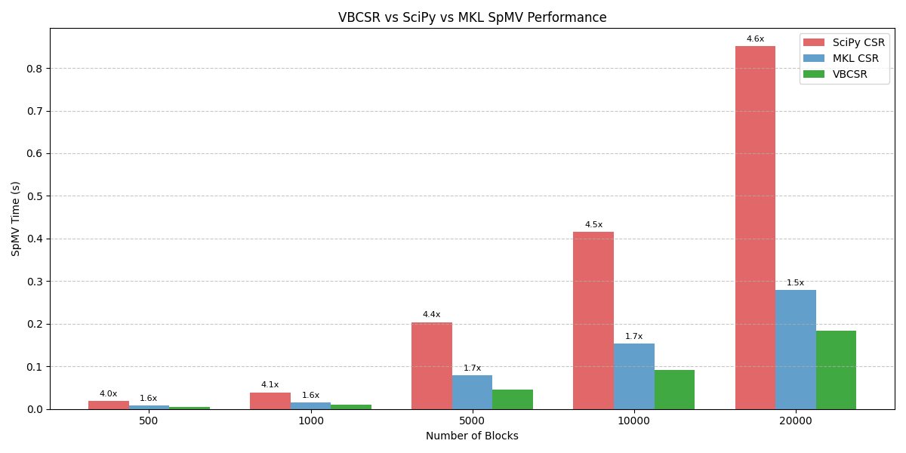

# VBCSR

Variable Block Compressed Sparse Row (VBCSR) Matrix library with MPI support.

VBCSR is a high-performance distributed sparse matrix library designed for efficiency and ease of use. It combines the speed of optimized C++ kernels with the flexibility of Python.

**Why VBCSR?**
- **Hardware-Accelerated Performance**: Leveraging SIMD (AVX/AVX2) instructions, precaching and threading, VBCSR delivers state-of-the-art performance for block-sparse matrix operations.
- **Easy Integration**: Header-only C++ core for easy inclusion in both Python and C++ projects.
- **Pythonic & Intuitive**: Perform complex linear algebra using natural Python syntax (`A * x`, `A + B`) and standard NumPy arrays.
- **Scalable & Distributed**: Built on MPI to handle massive datasets across distributed computing clusters.
- **Seamless Integration**: Drop-in compatibility with SciPy solvers (`scipy.sparse.linalg`) for easy integration into existing workflows. 

## Installation

```bash
pip install .
```
For advanced installation options (BLAS/MKL, OpenMP), please see [doc/advanced_installation.md](doc/advanced_installation.md).

## Documentation

- [User Guide](doc/user_guide.md): Comprehensive guide on concepts, usage, and examples.
- [API Reference](doc/api_reference.md): Detailed documentation of classes and methods.
- [Advanced Installation](doc/advanced_installation.md): Instructions for BLAS/MKL and OpenMP.

### VBCSR Performance Benchmark

Comparison of Matrix-Vector Multiplication (SpMV) performance between `vbcsr` (with MKL) and `scipy.sparse.csr_matrix`.

## Test Configuration
- **Block Size**: Random [16, 20]
- **Density**: Adaptive (ensuring ~200 non-zero blocks per row)
- **Data Type**: float64
- **System**: Linux, MKL Backend, 32 core 13th Gen Intel(R) Core(TM) i9-13900K

## Results

| Blocks | Approx Rows | VBCSR Time (s) | SciPy Time (s) | Speedup |
|--------|-------------|----------------|----------------|---------|
| 500 | ~9000 | 0.0049 | 0.0209 | **4.21x** |
| 1000 | ~18000 | 0.0096 | 0.0392 | **4.07x** |
| 5000 | ~90000 | 0.0468 | 0.2029 | **4.33x** |
| 10000 | ~180000 | 0.0931 | 0.4151 | **4.46x** |
| 20000 | ~360000 | 0.1866 | 0.8377 | **4.49x** |

## Visualization



## Usage Examples

### Basic Usage

```python
import numpy as np
import vbcsr
from mpi4py import MPI

# Create a serial matrix
comm = MPI.COMM_WORLD
mat = vbcsr.VBCSR.create_serial(comm, global_blocks=2, block_sizes=[2, 2], adjacency=[[0, 1], [0, 1]])

# Add blocks and assemble
mat.add_block(0, 0, np.eye(2))
mat.assemble()

# Matrix-Vector Multiplication
v = np.array([1.0, 2.0, 3.0, 4.0])
res = mat.mult(v)
print(res.to_numpy())
```

### Distributed Usage

```python
# Run with: mpirun -np 2 python script.py
import numpy as np
import vbcsr
from mpi4py import MPI

comm = MPI.COMM_WORLD
rank = comm.Get_rank()

# Define distributed structure (2 blocks total, 1 per rank)
owned_indices = [rank]
block_sizes = [2]
adjacency = [[0, 1]] # Both blocks connected to both

mat = vbcsr.VBCSR.create_distributed(comm, owned_indices, block_sizes, adjacency)

# Fill local blocks
mat.add_block(rank, 0, np.eye(2))
mat.add_block(rank, 1, np.eye(2))
mat.assemble()

v = mat.create_vector()
v.set_constant(1.0)
res = mat.mult(v)
print(f"Rank {rank}: {res.to_numpy()}")
```

### SciPy Integration

```python
from scipy.sparse.linalg import cg

# Use VBCSR as a LinearOperator
x, info = cg(mat, v, rtol=1e-5)
```

### Filtered SpMM
To perform sparse matrix-matrix multiplication with filtering (dropping small blocks), use the `spmm` method directly:

```python
# C = A * B, dropping blocks with Frobenius norm < 1e-6
C = A.spmm(B, threshold=1e-6)
```
