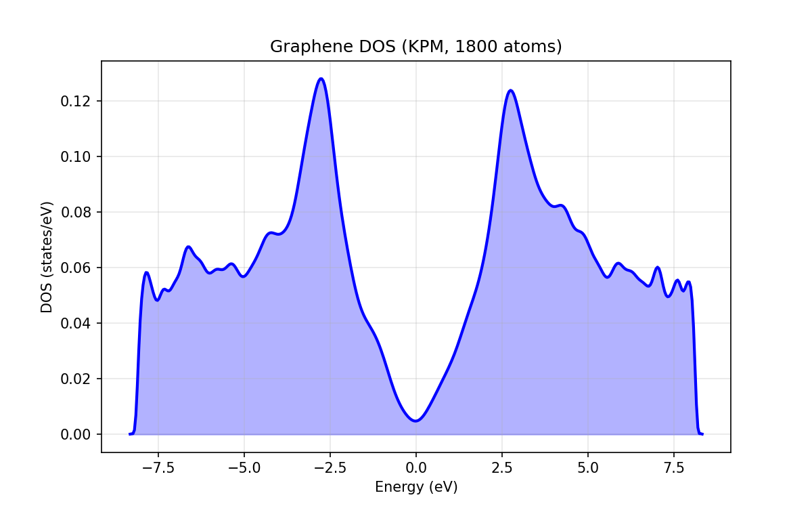
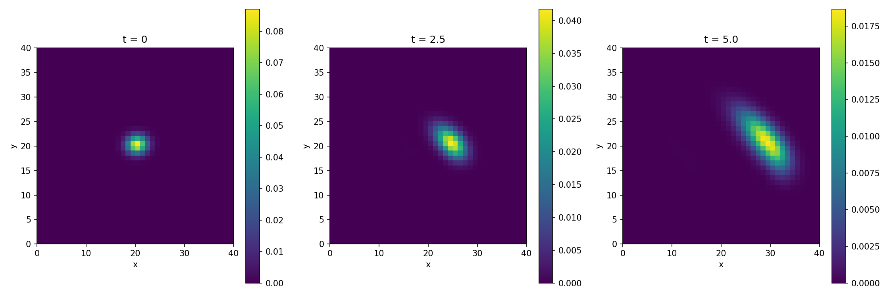

___

Distributed variable-block sparse matrices with fast block kernels + thresholded SpMM. Python-first, MPI-scalable, designed for localized-orbital Hamiltonians and multi-DOF PDE systems.

**Why VBCSR?**
- **Hardware-Accelerated Performance**: Leveraging SIMD (AVX/AVX2) instructions, precaching and threading, VBCSR delivers state-of-the-art performance for block-sparse matrix operations.
- **Easy Integration**: Header-only C++ core for easy inclusion in both Python and C++ projects.
- **Pythonic & Intuitive**: Perform complex linear algebra using natural Python syntax (`A * x`, `A + B`, `A @ B`) and standard NumPy arrays.
- **Scalable & Distributed**: Built on MPI to handle massive datasets across distributed computing clusters.
- **Seamless Integration**: Drop-in compatibility with SciPy solvers (`scipy.sparse.linalg`) for easy integration into existing workflows. 

## Real-World Applications

VBCSR is designed for complex physics and engineering simulations where block-sparse structures are natural.

### 1. Linear-Scaling Quantum Chemistry (McWeeny Purification)
Compute the density matrix of a large-scale system using **McWeeny Purification**. VBCSR's filtered SpMM ensures the matrix remains sparse throughout the iteration. See `/examples/ex07_graphene_purification.py` for a full implementation.

```python
# 1. Create a large-scale tight-binding Hamiltonian (e.g., 5000 blocks)
H = VBCSR.create_random(global_blocks=5000, block_size_min=4, block_size_max=8)

# 2. Simple spectral scaling
H.scale(0.1); H.shift(0.5)

# 3. McWeeny Purification: P_{n+1} = 3P_n^2 - 2P_n^3
P = H.copy()
for _ in range(10):
    P2 = P.spmm(P, threshold=1e-5)
    P = 3.0 * P2 - 2.0 * P2.spmm(P, threshold=1e-5)
# P is now the density matrix, distributed across your MPI cluster!
```

### 2. Stochastic Trace Estimation & DOS (KPM)
Compute the Density of States (DOS) using the **Kernel Polynomial Method (KPM)** with stochastic trace estimation. See `examples/ex08_graphene_dos.py` for a full implementation.



```python
energies, dos = compute_kpm_dos(H, num_moments=200, num_random_vecs=10)
```

### 3. Quantum Dynamics & PDE Solving
- **Quantum Dynamics**: Propagate wavepackets in time using Chebyshev expansion (`examples/ex09_graphene_dynamics.py`).



- **Variable-Block PDEs**: Solve heterogeneous systems (e.g., mixed Truss/Beam elements) with variable DOFs per node (`examples/ex10_variable_pde.py`).

## Installation

VBCSR requires a C++ compiler, MPI, and BLAS/LAPACK (OpenBLAS or MKL).

### Quick Start (Recommended)
```bash
conda install -c conda-forge openblas/mkl openmpi mpi4py
pip install vbcsr
```

### From Source
```bash
git clone https://github.com/yourusername/vbcsr.git
cd vbcsr
pip install .
```

For advanced installation options (MKL, OpenMP, etc.), see [doc/advanced_installation.md](doc/advanced_installation.md).

## Documentation

- [User Guide](doc/user_guide.md): Concepts, usage, and examples.
- [API Reference](doc/api_reference.md): Detailed documentation of classes and methods.
- [Advanced Installation](doc/advanced_installation.md): BLAS/MKL and OpenMP tuning.

### Performance at a Glance

VBCSR is designed for high-performance block-sparse operations, significantly outperforming standard CSR implementations for block-structured matrices.

| Blocks | Approx Rows | VBCSR Time (s) | SciPy Time (s) | Speedup |
|--------|-------------|----------------|----------------|---------|
| 500 | ~9000 | 0.0049 | 0.0209 | **4.21x** |
| 1000 | ~18000 | 0.0096 | 0.0392 | **4.07x** |
| 5000 | ~90000 | 0.0468 | 0.2029 | **4.33x** |
| 10000 | ~180000 | 0.0931 | 0.4151 | **4.46x** |
| 20000 | ~360000 | 0.1866 | 0.8377 | **4.49x** |


## Pythonic Usage

VBCSR matrices behave like first-class Python objects, supporting standard arithmetic and seamless integration with the SciPy ecosystem.

### 1. Easy Initialization from SciPy
Convert any SciPy sparse matrix (BSR or CSR) to a distributed VBCSR matrix in one line.

```python
import scipy.sparse as sp
from vbcsr import VBCSR

# Create a SciPy BSR matrix
A_scipy = sp.bsr_matrix(np.random.rand(100, 100), blocksize=(10, 10))

# Convert to VBCSR (automatically distributed if MPI is initialized)
A = VBCSR.from_scipy(A_scipy)
```

### 2. Natural Arithmetic & Operators
Use standard Python operators for matrix-vector and matrix-matrix operations.

```python
# Matrix-Vector Multiplication (SpMV)
y = A @ x  # or A.mult(x)

# Filtered Sparse Matrix-Matrix Multiplication (SpMM)
C = A @ B  # or A.spmm(B, threshold=1e-4)

# Matrix Arithmetic
D = 2.0 * A + B - 0.5 * C
```

### 3. Distributed Computing Made Simple
VBCSR handles the complexity of MPI communication behind the scenes.

```python
from mpi4py import MPI
comm = MPI.COMM_WORLD

# Create a distributed matrix with 100 blocks
A = VBCSR.create_random(global_blocks=100, block_size_min=4, block_size_max=8, comm=comm)

# Perform distributed SpMV
x = A.create_vector()
x.set_constant(1.0)
y = A @ x
```

### 4. Custom Distributed Creation
For full control, define your own block distribution and connectivity pattern.

```python
# Create the distributed matrix structure
A = VBCSR.create_distributed(owned_indices, block_sizes, adjacency, comm=comm)

# Fill blocks (can add local or remote blocks; VBCSR handles the exchange)
A.add_block(rank, rank, np.eye(2))
A.add_block(rank, (rank + 1) % comm.size, np.ones((2, 2)))

# Finalize assembly to synchronize remote data
A.assemble()
```

### 5. SciPy Solver Integration
VBCSR implements the `LinearOperator` interface, making it compatible with all SciPy iterative solvers.

```python
from scipy.sparse.linalg import cg

# Solve Ax = b using Conjugate Gradient
x, info = cg(A, b, rtol=1e-6)
```
